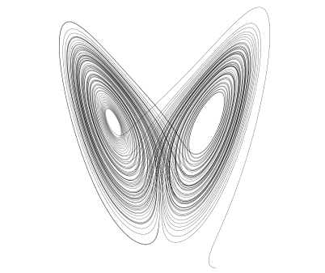

## The Lorenz attractor

Everyone likes the [Lorenz attractor](https://en.wikipedia.org/wiki/Lorenz_system), and it's useful here because we can show off how complex continuous time series render. Despite its simplicity, having just three equations, the Lorenz equations are chaotic

\begin{align}
\frac{\mathrm{d}x}{\mathrm{d}t} &= \sigma (y - x), \\[6pt]
\frac{\mathrm{d}y}{\mathrm{d}t} &= x (\rho - z) - y, \\[6pt]
\frac{\mathrm{d}z}{\mathrm{d}t} &= x y - \beta z.
\end{align}

Normally this is shown in phase view, which looks like butterfly wings

In the app though, we see the three variables against time.

If you zoom into the graph (select a rectangular region in the plot) you should see that the solution remains smooth no matter how far you zoom as we interpolate the solution to the selected range.

In the underlying markdown, we can use math expressions and they should render in the weird spidery LaTeX font that will feel instantly familiar to anyone who has debugged an overfull `\hbox` with badness 10000 while trying to write up their thesis. All the other useful markdown features should work out the box:

* Create bullet lists
* Use **bold** and *italics*
  1. add
  2. numbered
  3. lists
* Add [links](https://mrc-ide.github.io/odin) to sites
* Include pictures (see above)
